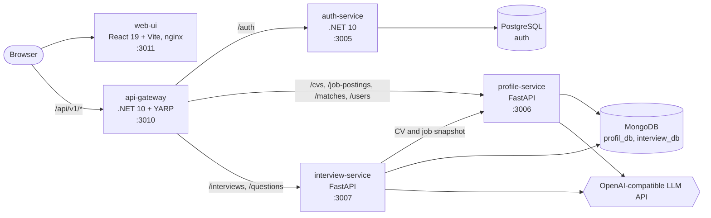
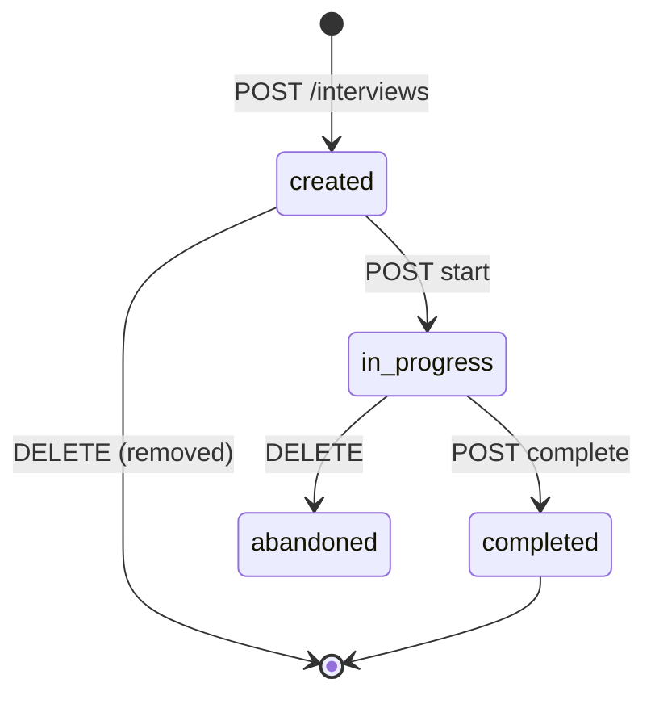

# InterviewAssistant

An AI-assisted job interview preparation platform built as a set of microservices.

A candidate uploads their CV (PDF) and pastes a job posting. The platform uses an LLM to score how well the CV matches the role and to list matching and missing skills. The candidate then runs a timed mock interview with questions drawn from a question pool or generated by the LLM from the CV and the job posting. At the end they get AI feedback on their answers.


---

## Table of contents

- [Project status](#project-status)
- [Architecture](#architecture)
- [Tech stack](#tech-stack)
- [Repository layout](#repository-layout)
- [Quick start (Docker Compose)](#quick-start-docker-compose)
- [Configuration](#configuration)
- [Authentication & security](#authentication--security)
- [API reference](#api-reference)
- [End-to-end example with curl](#end-to-end-example-with-curl)
- [Interview lifecycle](#interview-lifecycle)
- [LLM integration](#llm-integration)
- [Running services without Docker](#running-services-without-docker)
- [Testing](#testing)
- [Known limitations & roadmap](#known-limitations--roadmap)
- [Contributing](#contributing)
- [Team](#team)
- [License](#license)

---

## Project status

| Component | Status |
|---|---|
| **auth-service** | Working. Register, login, refresh, logout, forgot/reset password, Google sign-in. |
| **api-gateway** | Working. Routing, JWT validation, CORS, rate limiting. |
| **profile-service** | Working. PDF CV parsing, LLM-based CV ↔ job matching, match history. |
| **interview-service** | Working. Interview sessions, question pool, LLM-generated questions and feedback. Has a test suite. |
| **web-ui** | **Prototype.** All screens exist, but they run on **mock data**: the files in `web-ui/src/services/` return hard-coded responses and do not call the gateway yet. |

The backend can be used end to end through the gateway today. See [End-to-end example with curl](#end-to-end-example-with-curl).

---

## Architecture



- **The gateway is the single entry point.** The browser talks to the gateway only. The gateway forwards each request to a service based on its path prefix.
- **One shared JWT key.** auth-service signs tokens with the key in `JWTSETTINGS_KEY`. The gateway, profile-service and interview-service all validate tokens with the same key.
- **Each service owns its data.** auth-service uses PostgreSQL. profile-service and interview-service each use their own MongoDB database.
- **Services call each other directly.** When an interview is created, interview-service calls profile-service, forwarding the user's token, and saves a copy of the job posting and CV in the interview.

### Services

| Service | Folder | Tech | Host port → container port | Data store |
|---|---|---|---|---|
| web-ui | [`web-ui/`](web-ui/) | React 19, Vite 8, nginx | `3011 → 80` | none |
| api-gateway | [`api-gateway/`](api-gateway/) | ASP.NET Core 10, YARP 2.3 | `3010 → 8080` | none |
| auth-service | [`services/auth-service/`](services/auth-service/) | ASP.NET Core 10, EF Core, MediatR | `3005 → 8080` | PostgreSQL 17 (`auth`) |
| profile-service | [`services/profile-service/`](services/profile-service/) | Python 3.11, FastAPI, Motor | `3006 → 3006` | MongoDB 8 (`profil_db`) |
| interview-service | [`services/interview-service/`](services/interview-service/) | Python 3.12, FastAPI, Motor | `3007 → 8080` | MongoDB 8 (`interview_db`) |

---

## Tech stack

| Layer | Technologies |
|---|---|
| Gateway | ASP.NET Core 10, [YARP](https://microsoft.github.io/reverse-proxy/) reverse proxy, JwtBearer, built-in rate limiter |
| Auth | ASP.NET Core 10, Clean Architecture + CQRS (MediatR), FluentValidation, AutoMapper, EF Core + Npgsql, BCrypt.Net, MailKit (SMTP), Google.Apis.Auth, Swashbuckle |
| Profile | FastAPI, Motor (async MongoDB), PyJWT, pypdf, `openai` SDK |
| Interview | FastAPI, Motor, pydantic-settings, PyJWT, httpx, pytest + mongomock-motor |
| Frontend | React 19, Vite 8, plain CSS, ESLint |
| Data | PostgreSQL 17, MongoDB 8 |
| Infra | Docker, Docker Compose |

---

## Repository layout

```text
InterviewAssistant/
├── api-gateway/
│   ├── Gateway.API/                 # YARP routes (appsettings.json), JWT, CORS, rate limits (Program.cs)
│   └── Gateway.API.slnx
├── services/
│   ├── auth-service/                # Clean Architecture + CQRS
│   │   ├── Auth.API/                # Controllers, exception middleware, Program.cs (migrations + seed)
│   │   ├── core/
│   │   │   ├── Auth.Domain/         # Entities: User, Role, UserRole, RefreshToken
│   │   │   └── Auth.Application/    # Commands, handlers, validators, DTOs
│   │   ├── external/
│   │   │   └── Auth.Infrastructure/ # EF Core DbContext + migrations, JWT, BCrypt, email, Google
│   │   └── AuthService.slnx
│   ├── profile-service/             # main.py (routes), auth.py, database.py, llm_service.py
│   └── interview-service/
│       ├── app/
│       │   ├── api/                 # Routes and dependency wiring
│       │   ├── application/         # Use cases (services) and Pydantic schemas
│       │   ├── domain/              # Entities, enums, repository interfaces
│       │   ├── infrastructure/      # MongoDB, repositories, Profile/LLM HTTP clients
│       │   └── core/                # Settings, JWT security, exceptions
│       └── tests/                   # pytest suite
├── web-ui/                          # React SPA (src/pages, src/components, src/services)
├── docker-compose.yml               # Full local stack
├── .env.example                     # Template for the root .env read by docker-compose
└── pr-*-review.html                 # Archived code-review notes for PRs #3–#5
```

---

## Quick start (Docker Compose)

### Prerequisites

- [Docker](https://docs.docker.com/get-docker/) with Docker Compose v2
- An API key for an OpenAI-compatible LLM endpoint. This is optional, but CV analysis does not work without one. See [LLM integration](#llm-integration).
- `openssl` to generate the JWT key (any random string of 32+ characters works).

### 1. Create the `.env` file

```bash
cp .env.example .env
```

Fill in at least these values:

```dotenv
# At least 32 characters. Generate with: openssl rand -base64 48
JWTSETTINGS_KEY=
# Any password. PostgreSQL is created with it on first start.
AUTH_DB_PASSWORD=
# Needed for CV analysis (profile-service) and real LLM questions/feedback (interview-service)
LLM_API_KEY=
```

`docker compose` refuses to start if `JWTSETTINGS_KEY` or `AUTH_DB_PASSWORD` is empty. All variables are listed in [Configuration](#configuration).

### 2. Build and start everything

```bash
docker compose up --build
```

On startup auth-service applies its EF Core migrations to PostgreSQL and seeds a test user.

### 3. Open the services

| What | URL |
|---|---|
| Web UI | http://localhost:3011 |
| API gateway (use this for API calls) | http://localhost:3010 |
| Gateway health | http://localhost:3010/health |
| auth-service Swagger | http://localhost:3005/swagger |
| profile-service OpenAPI docs | http://localhost:3006/docs (ReDoc: `/redoc`) |
| interview-service OpenAPI docs | http://localhost:3007/docs (ReDoc: `/redoc`) |
| PostgreSQL | `localhost:5432` (db and user `auth` by default) |
| MongoDB | `localhost:27017` |

### Seeded test user (development only)

| Email | Password |
|---|---|
| `test@gmail.com` | `Password123` |

It is created at startup in `services/auth-service/Auth.API/Program.cs`.

### Stopping and resetting

```bash
docker compose down        # stop containers, keep data
docker compose down -v     # stop and delete the postgres-data and mongo-data volumes
```

---

## Configuration

### Root `.env` (read by `docker-compose.yml`)

| Variable | Required | `.env.example` value | Used by | Purpose |
|---|---|---|---|---|
| `JWTSETTINGS_KEY` | **yes** | — | auth, gateway, profile, interview | HMAC-SHA256 signing key, at least 32 characters. Must be the same everywhere. |
| `AUTH_DB_NAME` | no | `auth` | postgres, auth | PostgreSQL database name |
| `AUTH_DB_USER` | no | `auth` | postgres, auth | PostgreSQL user |
| `AUTH_DB_PASSWORD` | **yes** | — | postgres, auth | PostgreSQL password |
| `EMAIL_PASSWORD` | no | — | auth | SMTP password for the sender account in `Auth.API/appsettings.json` (Gmail, `smtp.gmail.com:587`). Needed for password-reset emails. |
| `GOOGLE_CLIENT_ID` | no | — | auth | Google OAuth client ID. Needed for `POST /api/v1/auth/googlelogin`. |
| `LLM_PROVIDER` | no | `openrouter` | interview | `anthropic`, `openai`, `openrouter` or `azure_openai`. If unset, compose falls back to `anthropic`. |
| `LLM_API_KEY` | recommended | — | profile, interview | LLM API key. If empty, interview-service uses an offline stub and CV analysis in profile-service fails. |
| `LLM_MODEL` | no | `google/gemma-4-31b` | profile, interview | Model name |
| `LLM_BASE_URL` | no | `https://evren-llmapi.ssyz.org.tr/v1` | profile, interview | OpenAI-compatible base URL. If empty, the provider's default is used. |
| `LLM_TIMEOUT_SECONDS` | no | `60` | profile, interview | LLM request timeout |
| `LLM_MAX_TOKENS` | no | `2000` | interview | Max tokens per LLM response |
| `PROFILE_TEXT_MAX_CHARS` | no | `6000` | interview | Max length of the CV/job text sent to the LLM |

> Never commit the real `.env`. It is in `.gitignore`, and only `.env.example` is tracked.

### Values set directly in `docker-compose.yml`

These are already wired for the compose network. You only need them when you run a service outside Docker.

| Service | Setting | Compose value |
|---|---|---|
| auth-service | `ConnectionStrings__DefaultConnection` | `Host=postgres;Port=5432;Database=…;Username=…;Password=…` |
| profile-service | `MONGODB_URI`, `MONGODB_DB_NAME` | `mongodb://mongodb:27017`, `profil_db` |
| interview-service | `MONGODB_URL`, `MONGODB_DATABASE` | `mongodb://mongodb:27017`, `interview_db` |
| interview-service | `PROFILE_SERVICE_URL` | `http://profile-service:3006` |
| interview-service | `APP_ENV` | `development` (enables `POST /dev/token`) |
| api-gateway | `Cors__AllowedOrigins__0` | `http://localhost:3011` |
| api-gateway | `ReverseProxy__Clusters__<cluster>__Destinations__destination1__Address` | `http://auth-service:8080`, `http://interview-service:8080`, `http://profile-service:3006` |
| web-ui | build arg `VITE_API_URL` | `http://localhost:3010` (baked in at build time) |

Other interview-service settings, such as default question count (5), per-question time limit (120 s) and page sizes, are in [`services/interview-service/app/core/config.py`](services/interview-service/app/core/config.py).

---

## Authentication & security

### JWT contract

All services share one contract, so a token from auth-service is accepted everywhere:

| Field | Value |
|---|---|
| Algorithm | HS256 (symmetric key `JWTSETTINGS_KEY`) |
| Issuer (`iss`) | `auth-servisi` |
| Audience (`aud`) | `mulakat-hazirlik` |
| Subject (`sub`) | User ID (GUID). The other services use it as the owner of CVs, matches and interviews. |
| Other claims | `email`, `given_name` |
| Access token lifetime | 60 minutes |
| Refresh token | Random 64-byte value stored in PostgreSQL. Valid for 7 days. Rotated on every refresh: the old token is revoked and a new pair is issued. |

### Gateway

- **JWT check.** Every route except `/api/v1/auth/**` requires a valid token. Missing or invalid tokens are rejected with `401` before they reach a service.
- **Defense in depth.** profile-service and interview-service validate the JWT again themselves, and they check that each resource belongs to the caller (`sub`).
- **Identity header.** The gateway always removes any `X-User-Id` header sent by the client. For authenticated requests it sets `X-User-Id` from the token's `sub`.
- **Rate limiting** (fixed window, `429` when exceeded):
  - `auth-limit`: 10 requests per minute per client IP, for auth routes.
  - `api-limit`: 100 requests per minute per user, falling back to IP, for all other routes.
- **CORS.** Only the origins in `Cors:AllowedOrigins` are allowed. The default is `http://localhost:3011`.

### Passwords

- Hashed with BCrypt.
- Must be 6–20 characters and contain an uppercase letter, a lowercase letter and a digit (`RegisterCommandValidator`).
- Password reset uses a 6-character code that is emailed to the user and expires after 15 minutes.

---

## API reference

All public endpoints go through the gateway at **`http://localhost:3010`**. Except for the auth endpoints, every request needs `Authorization: Bearer <accessToken>`.

### Auth (`auth-service`)

All endpoints are `POST` and take a JSON body. Responses use the envelope `{ "data": …, "isSuccessfull": bool, "message": "…", "errors": [] }`. Errors are returned as RFC 7807 `ProblemDetails`.

| Endpoint | Auth | Body | Description |
|---|---|---|---|
| `/api/v1/auth/register` | — | `firstName`, `lastName`, `email`, `password` | Create an account |
| `/api/v1/auth/login` | — | `email`, `password` | Returns `accessToken`, `accessTokenExpiration`, `refreshToken` |
| `/api/v1/auth/refreshtoken` | — | `accessToken`, `refreshToken` | Rotate the token pair |
| `/api/v1/auth/logout` | Bearer | `refreshToken` | Invalidate a refresh token |
| `/api/v1/auth/forgotpassword` | — | `email` | Email a 6-character reset code |
| `/api/v1/auth/resetpassword` | — | `email`, `token`, `newPassword` | Set a new password with the code |
| `/api/v1/auth/googlelogin` | — | `idToken` | Sign in with a Google ID token. Creates the user if it doesn't exist. |

### Profile & matching (`profile-service`)

| Method | Endpoint | Description |
|---|---|---|
| `POST` | `/api/v1/matches/analyze` | `multipart/form-data` with `cv_file` (PDF) and `job_text`. Extracts the CV text, runs the LLM analysis and stores the CV, the job posting and the match. Returns `match_id`, `job_posting_id`, `job_title`, `match_score`, `matching_skills`, `missing_skills`, `feedback`, `strong_matches`, `improvements`. |
| `GET` | `/api/v1/matches/history` | The caller's past matches, newest first |
| `GET` | `/api/v1/matches/{match_id}` | One match (owner only) |
| `GET` | `/api/v1/cvs/latest` | The caller's most recent CV |
| `GET` | `/api/v1/cvs/{cv_id}` | One CV (owner only) |
| `GET` | `/api/v1/users/{user_id}/cvs/latest` | Same as `/cvs/latest`, but `user_id` must equal the token's `sub` |
| `GET` | `/api/v1/job-postings/{job_posting_id}` | One job posting |

CVs and job postings are created only as a side effect of `/matches/analyze`. There are no separate create, update or delete endpoints for them.

### Interviews (`interview-service`)

| Method | Endpoint | Description |
|---|---|---|
| `POST` | `/api/v1/interviews` | Create a session. Body fields: `title`, `job_posting_id?`, `cv_id?`, `question_count?` (1–50, default 5), `use_generated_questions` (bool), `category?` |
| `GET` | `/api/v1/interviews` | List your sessions. Query params: `status`, `skip`, `limit` (max 100) |
| `GET` | `/api/v1/interviews/{session_id}` | Session details, including questions and answers |
| `DELETE` | `/api/v1/interviews/{session_id}` | Deletes the session, or marks it `abandoned` if it is in progress (`204`) |
| `POST` | `/api/v1/interviews/{session_id}/start` | `created → in_progress`. Starts the first question's timer. |
| `GET` | `/api/v1/interviews/{session_id}/current-question` | The current question, its remaining time and `is_last_question` |
| `POST` | `/api/v1/interviews/{session_id}/questions/{question_id}/start` | Mark a question as started |
| `POST` | `/api/v1/interviews/{session_id}/questions/{question_id}/answer` | Body `{ "answer_text": "…" }`. Moves on to the next question. |
| `POST` | `/api/v1/interviews/{session_id}/questions/{question_id}/skip` | Skip and move on to the next question |
| `POST` | `/api/v1/interviews/{session_id}/complete` | `in_progress → completed`. Generates the feedback. |
| `GET` | `/api/v1/interviews/{session_id}/feedback` | `summary`, `overall_score`, `strengths`, `improvements`, `per_question_feedback` |

### Question pool (`interview-service`)

Any authenticated user can manage the pool. Role checks are not implemented yet.

| Method | Endpoint | Description |
|---|---|---|
| `GET` | `/api/v1/questions` | List questions. Filters: `category`, `difficulty`, `status`, `tag` |
| `POST` | `/api/v1/questions` | Body fields: `text`, `category`, `difficulty` (`easy` \| `medium` \| `hard`), `tags`, `time_limit_seconds` (10–3600, default 120) |
| `GET` | `/api/v1/questions/{id}` | One question |
| `PATCH` | `/api/v1/questions/{id}` | Partial update |
| `DELETE` | `/api/v1/questions/{id}` | Archives the question (soft delete) |

### Endpoints that are not routed through the gateway

You can reach these directly on each service's host port:

| Endpoint | Services | Notes |
|---|---|---|
| `GET /health` | gateway, profile, interview | Liveness |
| `GET /ready` | profile, interview | Readiness. Checks the MongoDB connection. |
| `POST /dev/token` | profile, interview | **Development only.** Issues a test JWT signed with the shared key. profile-service: `?user_id=…`. interview-service: JSON body `{ "user_id": "…" }`. |
| `/swagger` | auth | Swagger UI (Development environment) |
| `/docs`, `/redoc` | profile, interview | OpenAPI UI |

---

## End-to-end example with curl

This walks through the full backend flow with the seeded user. It needs [`jq`](https://jqlang.org/), a PDF CV and a configured `LLM_API_KEY`.

```bash
GW=http://localhost:3010

# 1. Log in
TOKEN=$(curl -s -X POST "$GW/api/v1/auth/login" \
  -H "Content-Type: application/json" \
  -d '{"email":"test@gmail.com","password":"Password123"}' | jq -r '.data.accessToken')

# 2. Match a CV against a job posting
JOB_ID=$(curl -s -X POST "$GW/api/v1/matches/analyze" \
  -H "Authorization: Bearer $TOKEN" \
  -F "cv_file=@./my-cv.pdf" \
  -F "job_text=We are hiring a backend developer with Python, FastAPI and MongoDB experience." \
  | tee /dev/stderr | jq -r '.job_posting_id')

# 3. Create an interview with LLM-generated questions
#    (the question pool is empty on a fresh install)
SESSION_ID=$(curl -s -X POST "$GW/api/v1/interviews" \
  -H "Authorization: Bearer $TOKEN" -H "Content-Type: application/json" \
  -d "{\"title\":\"Backend practice\",\"job_posting_id\":\"$JOB_ID\",\"question_count\":3,\"use_generated_questions\":true}" \
  | jq -r '.id')

# 4. Start the interview and get the current question
curl -s -X POST "$GW/api/v1/interviews/$SESSION_ID/start" -H "Authorization: Bearer $TOKEN" > /dev/null
Q_ID=$(curl -s "$GW/api/v1/interviews/$SESSION_ID/current-question" \
  -H "Authorization: Bearer $TOKEN" | jq -r '.question.question_id')

# 5. Answer it (or POST .../skip). Repeat steps 4–5 for each question.
curl -s -X POST "$GW/api/v1/interviews/$SESSION_ID/questions/$Q_ID/answer" \
  -H "Authorization: Bearer $TOKEN" -H "Content-Type: application/json" \
  -d '{"answer_text":"I would design the API around ..."}'

# 6. Complete the interview and read the feedback
curl -s -X POST "$GW/api/v1/interviews/$SESSION_ID/complete" -H "Authorization: Bearer $TOKEN" > /dev/null
curl -s "$GW/api/v1/interviews/$SESSION_ID/feedback" -H "Authorization: Bearer $TOKEN" | jq
```

---

## Interview lifecycle



- **Question source.** If `use_generated_questions` is `false`, questions are picked at random from the pool, optionally filtered by `category`. If it is `true`, the LLM generates them from the job posting and CV. Pool-based sessions fail with `422` while the pool is empty, so add questions with `POST /api/v1/questions` first.
- **Profile snapshot.** When a session is created, interview-service fetches the job posting (`job_posting_id`) and the CV (`cv_id`, or the user's latest CV) from profile-service and stores a copy in the session. Past interviews therefore do not depend on profile-service later.
- **Server-side timing.** Question start time, answer time, elapsed time and remaining time are all computed from server timestamps. The client never sends timing data.
- **Question states.** Each question moves `pending → in_progress → answered | skipped`. Answering or skipping a question automatically starts the next one.
- **Feedback.** On `complete`, the LLM gets every question with its answer and status and returns a summary, an overall score, strengths, improvements and per-question feedback.
- **Error codes.** Invalid state transitions return `409`. Requests for another user's session return `403`.

---

## LLM integration

### profile-service

- Uses the official `openai` Python SDK against any OpenAI-compatible endpoint, configured with `LLM_BASE_URL`, `LLM_MODEL` and `LLM_API_KEY`.
- One Turkish HR-analyst prompt (temperature 0, JSON output) extracts the job details (title, seniority, technical skills) and produces the match analysis.
- The client is created lazily, so the service starts without a key. Calls to `/matches/analyze` fail with `500` until `LLM_API_KEY` is set.

### interview-service

The provider is chosen with `LLM_PROVIDER`:

| `LLM_PROVIDER` | Default base URL | Default model | Notes |
|---|---|---|---|
| `anthropic` | `https://api.anthropic.com` | `claude-sonnet-5` | Messages API |
| `openai` | `https://api.openai.com/v1` | `gpt-4o-mini` | Chat Completions |
| `openrouter` | `https://openrouter.ai/api/v1` | `google/gemma-4-31b-it:free` | Same code path as `openai`. Use this for any OpenAI-compatible endpoint. |
| `azure_openai` | — (`LLM_BASE_URL` required) | `AZURE_OPENAI_DEPLOYMENT` | Uses the `api-key` header and `AZURE_OPENAI_API_VERSION` |

- **Offline stub.** If `LLM_API_KEY` is empty, a deterministic `StubLLMClient` is used. The service, its tests and full interview runs then work without network access. If a real provider fails at runtime, the request returns `502`. It does not fall back to the stub.
- **Prompt-injection hardening.** CV, job and answer text is untrusted. It is wrapped in tags, sanitized and capped at `PROFILE_TEXT_MAX_CHARS` before it goes into a prompt. JSON responses are still extracted when the model wraps them in code fences or prose.

### Default configuration

`.env.example` points both services at the **Evren LLM API** (`https://evren-llmapi.ssyz.org.tr/v1`, model `google/gemma-4-31b`). interview-service uses the `openrouter` (OpenAI-compatible) code path, so one key serves both services.

---

## Running services without Docker

Use this when you want to debug one service with hot reload. Start only the databases with Compose, using the `.env` from [Quick start](#quick-start-docker-compose):

```bash
docker compose up -d postgres mongodb
```

### auth-service (.NET 10 SDK)

```bash
cd services/auth-service/Auth.API
dotnet user-secrets set "ConnectionStrings:DefaultConnection" "Host=localhost;Port=5432;Database=auth;Username=auth;Password=<AUTH_DB_PASSWORD>"
dotnet user-secrets set "JwtSettings:Key" "<JWTSETTINGS_KEY>"
dotnet user-secrets set "EmailSettings:Password" "<smtp password>"   # optional
dotnet user-secrets set "Google:ClientId" "<google client id>"       # optional
dotnet run                                                           # http://localhost:3005/swagger
```

To add a migration (needs the `dotnet-ef` tool):

```bash
dotnet ef migrations add <Name> \
  --project services/auth-service/external/Auth.Infrastructure \
  --startup-project services/auth-service/Auth.API
```

### api-gateway (.NET 10 SDK)

`appsettings.json` uses placeholder hostnames (`auth.api`, `interview.api`, `cv.api`). Point the clusters at your local ports instead:

```bash
cd api-gateway/Gateway.API
dotnet user-secrets set "JwtSettings:Key" "<JWTSETTINGS_KEY>"
dotnet user-secrets set "ReverseProxy:Clusters:auth-cluster:Destinations:destination1:Address" "http://localhost:3005"
dotnet user-secrets set "ReverseProxy:Clusters:profile-cluster:Destinations:destination1:Address" "http://localhost:3006"
dotnet user-secrets set "ReverseProxy:Clusters:interview-cluster:Destinations:destination1:Address" "http://localhost:3007"
dotnet run                                                           # http://localhost:3010
```

### profile-service (Python 3.11+)

The service also reads a local `.env` file through `python-dotenv`.

```bash
cd services/profile-service
python3 -m venv .venv && source .venv/bin/activate
pip install -r requirements.txt
export MONGODB_URI=mongodb://localhost:27017 MONGODB_DB_NAME=profil_db \
       JWT_SECRET_KEY="<JWTSETTINGS_KEY>" \
       LLM_API_KEY="<key>" LLM_BASE_URL="https://evren-llmapi.ssyz.org.tr/v1" LLM_MODEL="google/gemma-4-31b"
uvicorn main:app --reload --port 3006
```

### interview-service (Python 3.12+)

```bash
cd services/interview-service
python3 -m venv .venv && source .venv/bin/activate
pip install -r requirements.txt
cp .env.example .env
# Edit .env: JWT_SECRET_KEY=<JWTSETTINGS_KEY>, MONGODB_URL=mongodb://localhost:27017,
#            PROFILE_SERVICE_URL=http://localhost:3006, LLM_* as needed
uvicorn app.main:app --reload --port 3007
```

### web-ui (Node.js 20.19+ or 22.12+)

```bash
cd web-ui
npm install
npm run dev        # Vite dev server, http://localhost:5173
npm run build      # production build into web-ui/dist
npm run lint
```

> Once the UI calls the real API, add the Vite dev origin (`http://localhost:5173`) to the gateway's `Cors:AllowedOrigins`. Only `http://localhost:3011` is allowed by default.

---

## Testing

| Component | Command | Notes |
|---|---|---|
| interview-service | `cd services/interview-service && pip install -r requirements.txt && pytest -q` | 54 tests covering system endpoints, auth, questions, interview lifecycle, profile snapshot, LLM client parsing and repositories. MongoDB is replaced by `mongomock-motor` and profile-service by an in-process fake, so no running services are needed. |
| web-ui | `cd web-ui && npm run lint` | ESLint only. There are no unit tests yet. |
| auth-service, api-gateway, profile-service | — | No automated tests yet. Use Swagger, `/docs` or the [curl example](#end-to-end-example-with-curl). |

---

## Known limitations & roadmap

- [ ] **The web-ui is not connected to the backend yet.** The files in `web-ui/src/services/` return mock data. There is no router (screens are switched with `useState` in `App.jsx`), and tokens are not stored. Next step: call the gateway through `VITE_API_URL`, store and refresh tokens, and add a router.
- [ ] **The CV snapshot field doesn't match.** interview-service reads the CV text from a `summary` field (`app/application/services/interview_service.py`), but profile-service stores `raw_text` and `skills`. As a result, generated questions currently get no CV context.
- [ ] **The dev token endpoints are reachable.** profile-service's `POST /dev/token` is always enabled. interview-service's is enabled unless `APP_ENV=production` or `ENABLE_DEV_TOKEN_ENDPOINT=false`. Both are exposed on host ports in `docker-compose.yml`, so the compose file is for local development only.
- [ ] **Google sign-in sessions can't be refreshed.** `GoogleLoginCommandHandler` returns a refresh token but does not save it, so `/refreshtoken` fails after a Google sign-in.
- [ ] **There is no email verification.** Email is only used for password-reset codes.
- [ ] **There are no roles.** Any authenticated user can manage the question pool. Admin checks are planned once auth-service issues role claims.
- [ ] **Test coverage is partial.** auth-service, api-gateway and profile-service have no automated tests yet.
- [ ] **Template leftovers remain.** The root `public/` folder comes from the Vite template and is not served, so `web-ui/index.html`'s `/favicon.svg` link returns 404.
- [ ] **The interview-service README is outdated.** [`services/interview-service/README.md`](services/interview-service/README.md) was written before the shared compose file and the extra LLM providers. Where the two disagree, this README and `docker-compose.yml` are correct.

---

## Contributing

1. Branch off `main` with a descriptive prefix: `feature/…`, `fix/…` or `chore/…`.
2. Write commit messages in the [Conventional Commits](https://www.conventionalcommits.org/) style with a scope, for example `feat(auth): …`, `fix(gateway): …` or `chore: …`.
3. Open a pull request into `main` and get a review before merging.
4. Never commit secrets: `.env`, `appsettings.Development.json` and real keys in `appsettings.json` are all off limits. Add new settings to `.env.example` with an empty value or a safe default.
5. If you change a port, a route or an environment variable, update `docker-compose.yml`, `.env.example` and this README in the same PR.

---

## Team

| Contributor | Area |
|---|---|
| Özkan Yılmaz | auth-service, api-gateway |
| Baha Ok | web-ui |
| erva-nur | profile-service |
| nerminkilicarslan | interview-service |

---
## **Screens**
LoginScreen

HomeScreen

AnalyseScreen

InterviewStartScreen

InterviewScreen

ReportScreen

## License

No license file has been added yet. Until one is, all rights are reserved by the project authors.
